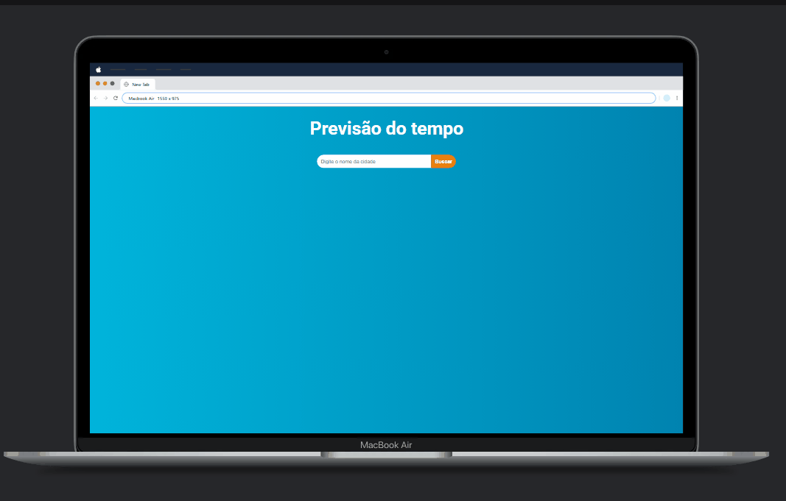

# App Previsão do tempo

## Descrição

Aplicação de previsão do tempo desenvolvido com React.js.

## Objetivo 🎯

- Ao digitar qualquer cidade do mundo, aparecerá as informações da previsão do tempo;
- Dentre as informações apareceria o temperatura máxima e mínima, sensação térmica, umidade, imagem, nome da cidade e temperatura atual.

## Ferramentas Utilizadas 🛠️
- **React**: Biblioteca para criar interfaces de usuário dinâmicas e reativas;
- **AXIOS**: Biblioteca usada para fazer a requisição para a API;
- **Styled-Components**: Para estilização baseada em componentes, permitindo tema dinâmico e estilo modularizado;
- **Vite**: Ferramenta de construção para desenvolvimento front-end rápido e otimizado;
- **API**: API pública usada para obter os dados da previsão;
- **Responsividade**: Assim a aplicação se adapta a vários formatos de telas sem apresentar erros no layout.

## Layout 💻📱


## Tecnologias utilizadas
[](https://skillicons.dev)

## Passo a Passo para Rodar o Projeto 🚀

1. **Clone o repositório:**
   ```bash
   git clone <url-do-repositorio>
   ```

2. **Acesse o diretório do projeto:**
   ```bash
   cd previsao-do-tempo
   ```

3. **Instale as dependências:**
   ```bash
   npm install
   ```

4. **Inicie o servidor de desenvolvimento:**
   ```bash
   npm run dev
   ```

5. **Acesse no navegador:**
   Clique no link que abrirá.
